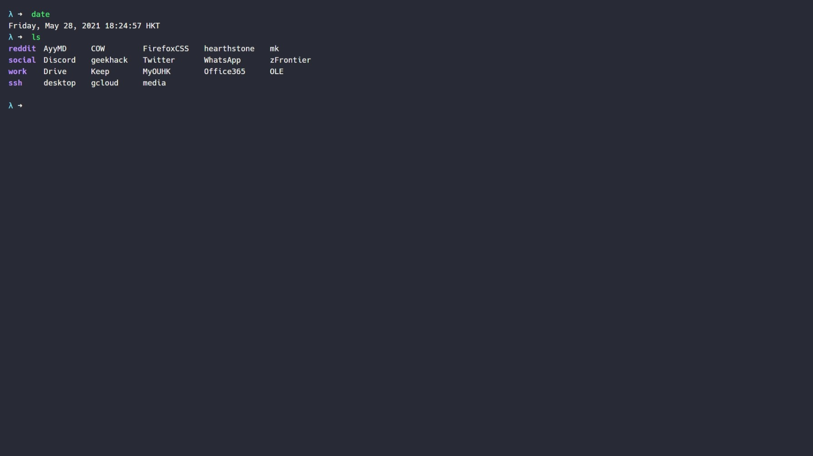

# Startpage

Now uses a xml config file, requires [self hosting](eb2ab6760748dca848b3e07c46c4117afc2e7483) to use it.

Old version is under the [legacy branch](https://gitlab.com/timescam/startpage/-/tree/legacy) and will not be maintained anymore.

## Screenshot



## How to use config.xml

```xml
<?xml version="1.0" encoding="UTF-8"?>
<config>

	<clock> <!-- do not change this -->
		<timezone>HKT</timezone> <!--visual change only, can be leave blank -->
		<url>https://calendar.google.com/calendar/</url> <!-- shortcut on the clock -->
	</clock>

	<shortcuts> <!-- do not change this -->
		<reddit> <!-- category name displayed as a folder in ls-->
			<title>AyyMD</title> <!-- shortcut name displayed as a file in ls-->
			<url>https://www.reddit.com/r/AyyMD/</url> <!-- url for shortcut -->
		</reddit>
		<reddit> <!-- add another block for another url in the same category -->
			<title>COW</title>
			<url>https://www.reddit.com/r/Competitiveoverwatch/</url>
		</reddit>

		<social> <!-- new category -->
			<title>Discord</title>
			<url>https://discordapp.com/app</url>
		</social>

		<ssh>
			<title>desktop</title>
			<url>ssh://0.0.0.0</url> <!-- works with all kinds of url -->
		</ssh>

		<!-- add as many as u want -->

	</shortcuts>

	<search>https://www.duckduckgoog.com/</search> <!-- search engine url -->

</config>
```
